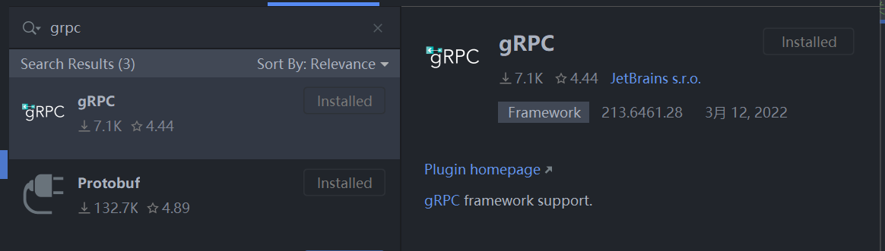
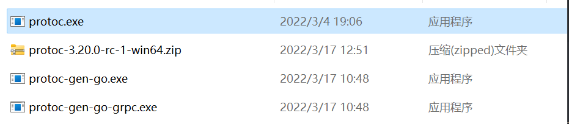
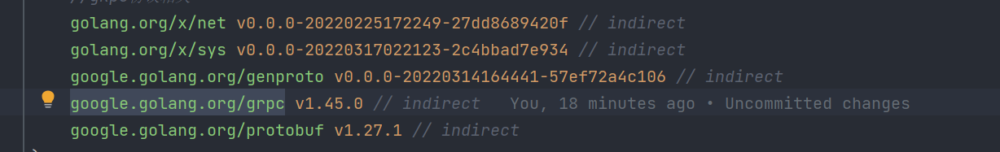

**1.gRpc介绍**

所谓RPC(remote procedure call 远程过程调用)框架实际是提供了一套机制，
使得应用程序之间可以进行通信， 而且也遵从server/client模型。使用的时候客
户端调用server端提供的接口就像是调用本地的函数一样。
gRpc是基于Protobuf(二进制序列缓冲协议来定义接口与服务)

安装图片中的两个插件(gRpc,Protobuf)

**2.使用**

安装晚上述插件之后重新启动IDE，创建一个mod项目，在终端执行以下命令:
go get -u google.golang.org/grpc

go install google.golang.org/protobuf/cmd/protoc-gen-go@v1.26

go install google.golang.org/grpc/cmd/protoc-gen-go-grpc@v1.1

若这两条命令执行不成功建议切换mod代理:GOPROXY=https://goproxy.cn,direct,
或者也可进行科学上网，执行完后会在GOPATH路径下出现两个EXE文件(如果下载不成功可直接下载对应的
文件放进自己的GOPATH的bin目录下)

其次还需要下载proto相关的exe文件

解压之后得到protoc.exe文件

上图是最后关于gRpc所有的相关文件(注意:这些相关的文件全部在GOPATH的bin目录下)

**3.定义服务**

相关环境准备好以后，可以开始定义服务了，其服务的定义通过proto文件进行定义，详情查看官网。
在定义完成服务之后，终端进入到当前proto目录下，执行build.bat命令,生成相关代码。注意:
不管是proto还是thrift都是一种语法格式，通过这种语法格式来定义服务，通过这种方式来解决
语言之间的耦合(Java中不管是feign还是dubbo都是通过Java语言+注解的形式来定义对应的服务
与方法，这样造成的问题是服务提供方和服务消费方只能由Java语言编写)，gRpc和thrift这两个
协议通过中间文件的形式解决语言直接的耦合性，即客户端生成对应的语言，消费端生成对应的语言。

其次gRpc和thrift相比于feign这种协议来说，性能更高，因为feign是基于http协议来做的过程
调用，而http是一个应用层协议，消息通过网络传递时需要进行频繁的装包和拆包(gRpc和thrift避免
了这个过程)。

**4.相关mod**

