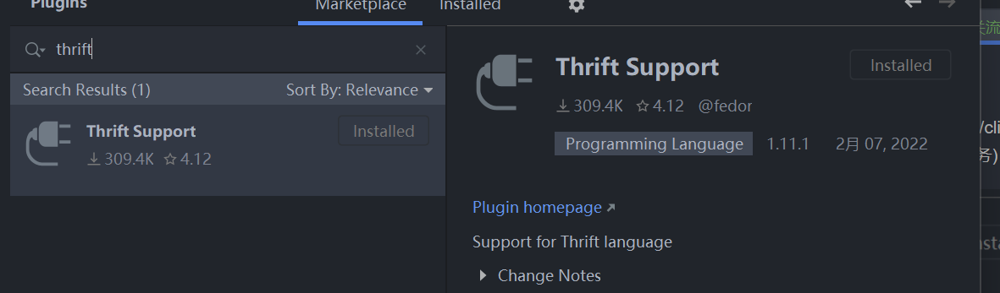
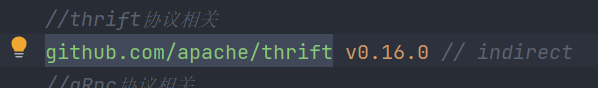

**1.介绍**

thrift和gRpc一样，都是基于二进制的协议，相比于基于http的feign的rpc过程调用
来说，前两者的性能会后后者高。thrift与gRpc类似都是通过中间文件来定以服务，然后
生成服务相关的代码，再有客户端和服务端进行实现。(注:thrift是有FaceBook开源，而gRpc
是由google开源)

2.使用

下载上图相关插件，其次执行

go get -u github.com/apache/thrift

下载相关的mod，其次下载

链接:https://dlcdn.apache.org/thrift/0.16.0/thrift-0.16.0.exe

将下载下来的exe文件放进GOPATH的bin目录之下，之后打开cmd命令行执行

thrift -version

命令，若出现相对应的版本，则环境准备成功

**3.定义服务**

与gRpc一样，thrift也需要一个文件来定义服务和接口，具体定义方式详细查看官网，定义
完成之后带当前目录下执行build.bat命令

**4.相关mod**

